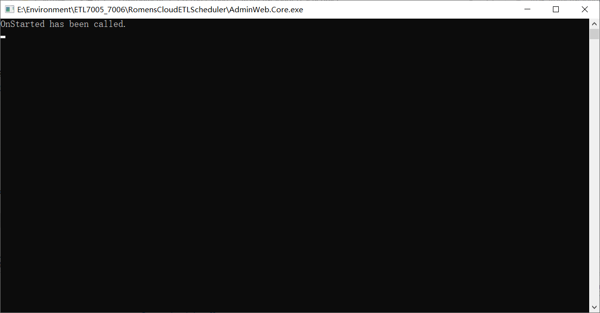
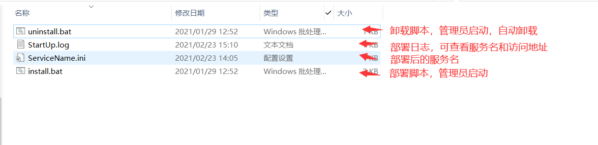

======================
部署
======================
Windows下部署
===========================
尤其 ``IIS`` 的垃圾回收问题，所以调度平台在Linux部署时，需要直接托管到 **Windows服务** 

* 安装 `VC++2015 <https://www.microsoft.com/zh-cn/download/details.aspx?id=53840>`_ 
* 安装netcore的环境， 下载并安装 `netcore3.1的SDK <https://dotnet.microsoft.com/download/dotnet/thank-you/sdk-3.1.406-windows-x64-installer>`_ 
* 测试环境是否满足条件，双击启动 ``AdminWeb.Core.exe`` 应用程序即可，出现 **OnStarted has been called.** 并且没有任务错误日志，即可视为Windows环境没问题

* 部署，程序目录下右键 **以管理员启动** ``install.bat`` 脚本，按照要求安装即可，安装成功后，可在 ``StartUp`` 查看服务名和访问地址

Linux下部署
===========================

* 直接部署主机上，通常需要 ``Nginx`` + ``NetCore`` + ``Supervisor`` ，可以自己 `百度一下 <https://www.baidu.com>`_ 
* 部署在 ``docker`` 容器里， :doc:`docker启动 <../scheduler-start/index>` 