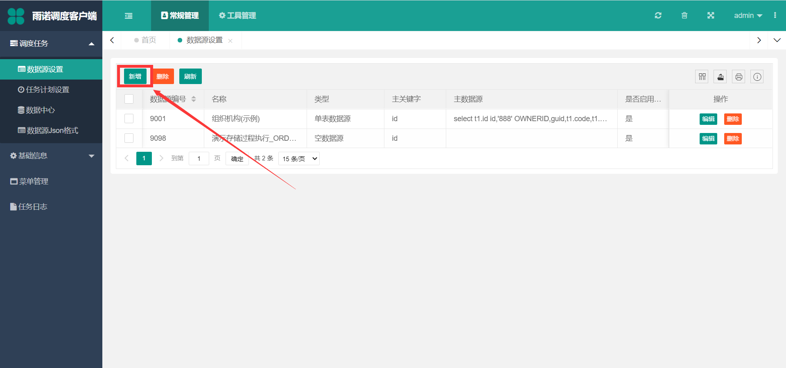
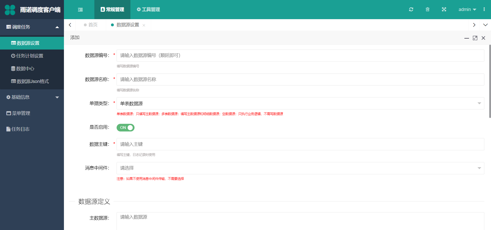

=================================
数据源设置
=================================

新增
===========================

点击 `新增` 按钮，增加数据源

- ``数据源编号``：保持唯一即可
- ``数据源名称``：符合数据源的含义即可
- ``单据类型``：根据不同的业务场景和需求来选择对应的单据类型
   + ``单表数据源``：简而言之，就是能够通过在 **主数据源** 定义一条SQL语句，能够查出一张表的数据，根据任务计划配置的调度周期，将该数据传到插件进行处理
   + ``多表数据源``：针对主子表，为了保证主子表的数据结构完整，例如订单（主单、明细），能够通过在 **主数据源** 定义查询主单数据的SQL语句，再在 **明细数据源** 配置查询对应明细的SQL语句，将主单和明细查出来的数据，根据任务计划配置的调度周期传到插件进行处理
   + ``空数据源``：有时候，我们只需要调度去处理插件内的逻辑，不需要传任何数据，那选择该选项则只会根据任务计划设置的调度周期来执行插件内的逻辑
- ``是否启用``: 选择是即可，如果选择否，则任务执行时，该数据源会自动过滤
- ``数据主键``：**该字段必须是主数据源的字段** ，目前该数据主键只起到在任务日志中记录哪些数据成功和失败的日志查找作用
- ``消息中间件``：非必填，针对插件中需要使用 ``RabbitMQ`` 或者 ``Kafka`` 消息中间件，可以配置这个，**后面会讲插件中如何直接是用消息中间件**
- ``主数据源``：当 ``单据类型`` 选择 ``单表数据源`` 或者 ``多表数据源`` 的时候，该信息项 **必填** ，填写的格式必须是 ``SQL格式``
- ``明细数据源1``：当 ``单据类型`` 选择 ``多表数据源`` 的时候，该信息项，该信息项 **必填** ，填写的格式必须也是 ``SQL格式``，配置该SQL的时候，如果有用到主数据源中的查询出来的相关数据，例如：订单的明细需要取 ``主表数据源`` 对应订单的订单号，用大括号 `{}+$` 符号来配置 ``{$主数据源的列（sql查出来的caption）$}`` 
- ``明细数据源2``：同 ``明细数据源1`` ，属于同一级
- ``明细数据源3``：同 ``明细数据源1`` 和 ``明细数据源2`` ，属于同一级
- ``失败后执行的SQL``：当自定义的插件返回 ``true`` 时 ，则会执行该文本框内的 ``SQL集合`` ，通过 ``;`` 符号来分隔SQL语句，如果想要使用 ``主数据源`` 的列数据，，也需要用大括号 `{}+$` 符号来配置 ``{$主数据源的列（sql查出来的caption）$}`` 
- ``成功后执行的SQL``：当自定义的插件返回 ``false`` 时 ，则会执行该文本框内的 ``SQL集合`` ，通过 ``;`` 符号来分隔SQL语句，如果想要使用 ``主数据源`` 的列数据，，也需要用大括号 `{}+$` 符号来配置 ``{$主数据源的列（sql查出来的caption）$}`` 
- ``连接字符串`` ：该信息项，常用来将一些开放的参数填写在这个位置，可以选填一些参数，如地址、用户信息等参数，该文本框内填写的内容，插件能够很轻松获取到（**任务计划设置的配置文件也有此功能，不过没有这个参数方便，详情请看任务计划设置的配置文件配置**）

修改
===========================

修改数据源后，不需要重启对应的任务计划，每次调度都会取最新修改后的数据源
