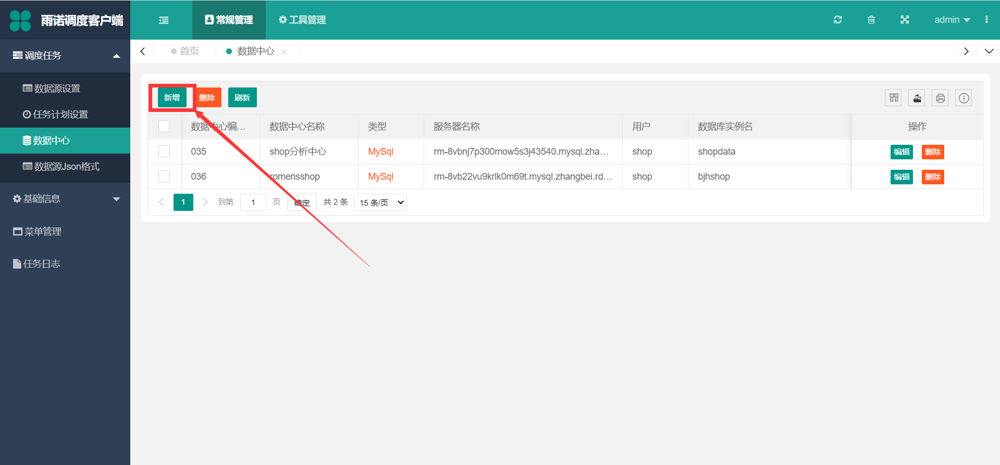
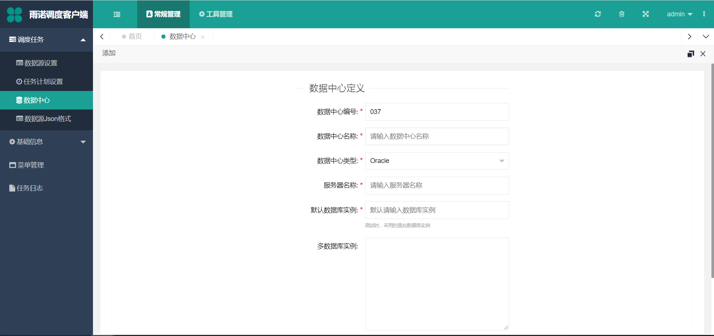

=================================
数据中心设置
=================================

在 :doc:`维护好数据源后 <../scheduler-tasksetting/datasourcesetting>`，需要维护数据库，来判断调度任务从以哪个数据库作为源数据库。让我们开始配置 ``数据中心`` ：

- ``数据中心编号``：必填，保持唯一即可
- ``数据中心名称``：必填，符合数据库的含义即可
- ``数据中心类型``：必填，目前支持 ``Oracle`` 、``SqlServer`` 、``MySql`` 三种数据库
- ``数据库名称``：必填，服务器地址或者服务器名称
- ``默认数据库实例``：必填，数据库实例
- ``多数据库实例``：非必填，此处可以设置多个数据库，如果想要针对多个数据库传输（前提是对应的数据源的相关表的数据结构必须保持一致，与默认数据库实例的用户密码也一致）
- ``用户名``：数据库用户名
- ``密码``：用户密码
  
**注意：** 如果端口使用的不是默认端口， ``数据库名称`` 处，按照 ``数据库名称,端口`` 填写即可

