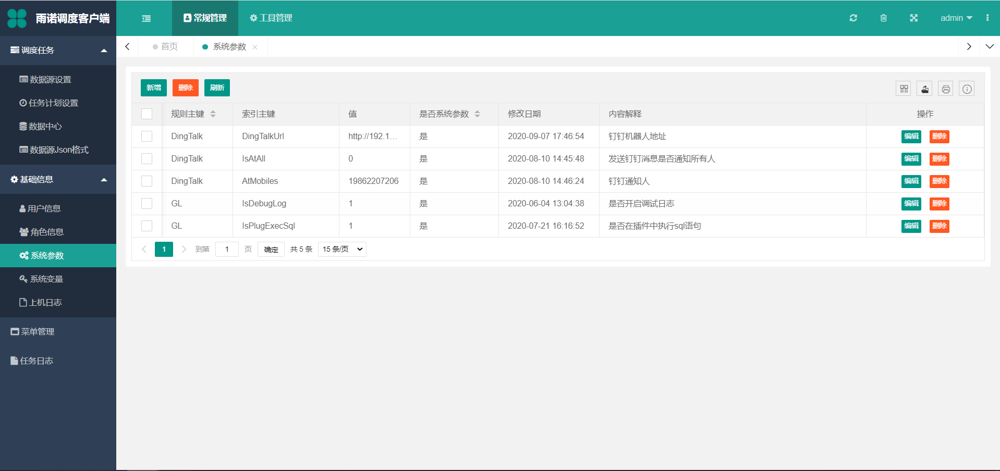

========================================
系统参数
========================================

+ ``IsDebugLog``：是否开启日志
.. note::
    前提是使用应用自带的日志组件 

    private static readonly AdminWeb.Core.TaskJob.LogHelper _logHelper = new LogHelper();

    或者，通过传入的参数判断

    var isDebugLog= jobpara.IsDebugLog;

+ ``IsPlugExecSql``：设置为1， :doc:`数据源设置中的成功和失败语句 <../scheduler-tasksetting/datasourcesetting>` 不会执行，如果需要在插件执行，可以在插件获取到数据源设置中成功和失败定义好的语句

.. note::
    var successSql = jobpara.SuccessSqlString;//数据源设置的成功后执行语句

    var failSql = jobpara.FailSqlString;//数据源设置的失败后执行语句